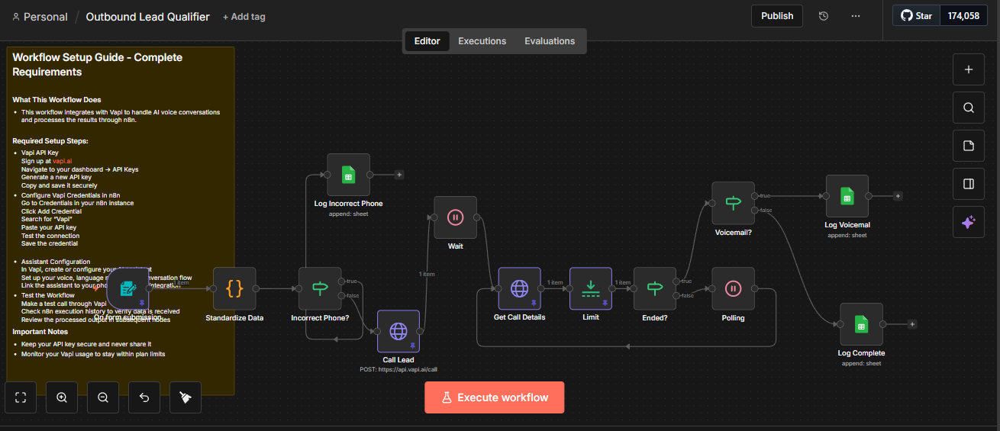

# AI Outbound Lead Qualification Workflow (n8n + Vapi)
[Watch Demo Video](https://go.screenpal.com/watch/cOnXXwn0idg)

## ROI Statement

This workflow automatically calls and qualifies every lead immediately after they submit a form.

### Instead of:
*   Manually calling every new lead
*   Responding too late and losing hot prospects
*   Paying staff to filter unqualified inquiries

### You get:
*   **Instant outbound AI calls**
*   **Structured qualification data**
*   **Automated logging**
*   **Zero manual follow-up** for basic screening

**Faster response increases conversion rates.**  
**Pre-qualified leads increase sales efficiency.**  
**Less manual work reduces operational cost.**  

*This directly improves revenue per lead.*

---

## Workflow Overview

### What This Workflow Does
1.  **A prospect submits a form.**
2.  **The phone number is standardized and validated.**
    *   If invalid → logged as "Incorrect Phone #".
    *   If valid → Vapi places an outbound AI call.
3.  **The AI assistant:**
    *   Greets the lead
    *   Asks qualification questions
    *   Extracts structured outputs
4.  **n8n polls Vapi until the call ends.**
5.  **Based on the result:**
    *   **Voicemail** → Logged as "Call Back"
    *   **Completed call** → Structured qualification data logged to Google Sheets

All results are stored automatically.

---

## Structured Data Collected

From each completed call, the assistant returns:
*   Service Interest
*   Budget
*   Paid Intent
*   Motivation
*   Urgency
*   Past Experience

### This enables:
*   Lead scoring
*   Sales prioritization
*   CRM routing
*   Conversion analysis

---

## Setup Guide

### Requirements
You need:
*   **n8n** (Cloud or Self-Hosted)
*   **Vapi account**
*   **Google Sheets**
*   This repository folder containing:
    *   `workflow.json`
    *   `n8n.png`
    *   `README.md`

### 1. Import the Workflow
1.  Open n8n.
2.  Go to **Workflows**.
3.  Click **"Import from File"**.
4.  Upload `workflow.json`.
5.  Save the workflow.

### 2. Set Up Vapi
#### Create an Account
Sign up at: [https://vapi.ai](https://vapi.ai)

#### Create an Assistant
Inside Vapi:
1.  Create a new Assistant.
2.  Configure:
    *   Voice
    *   Language model
    *   Conversation script
3.  Add **structured outputs** for:
    *   Service Interest
    *   Budget
    *   Paid Intent
    *   Motivation
    *   Urgency
    *   Past Experience

*Note: Each structured output generates an ID. You must map those IDs inside the "Log Complete" node in n8n.*

### 3. Get Your Vapi Credentials
1.  Go to the Vapi Dashboard.
2.  Navigate to **API Keys**.
3.  Generate a new API key.
4.  Copy and store it securely.

### 4. Configure n8n Credentials
#### Vapi Credential
1.  Go to **Credentials** in n8n.
2.  Add a new credential.
3.  Choose **HTTP Bearer Auth**.
4.  Paste your Vapi API key.
5.  Save.

### 5. Configure Google Sheets
1.  Create a Google Sheet for logging.
2.  Ensure column names match the workflow mappings.
3.  In n8n:
    *   Connect Google Sheets credential.
    *   Select the correct spreadsheet.
    *   Select the correct sheet tab.

*There are separate logs for: Incorrect numbers, Voicemail / call back, and Completed qualified calls.*

### 6. Configure Assistant and Phone IDs
In the **"Call Lead"** node:
Replace:
*   `assistantId`
*   `phoneNumberId`

With your own values from the Vapi dashboard.

### 7. Test the Workflow
1.  Activate the workflow.
2.  Submit the form.
3.  Monitor execution history.
4.  Verify:
    *   The AI call is placed.
    *   Call status updates properly.
    *   Structured outputs are returned.
    *   Data appears in Google Sheets.

---

## Workflow Logic Summary

**Form Submission**  
➔ Standardize Phone  
➔ Validate  

*   **If invalid:**  
    ➔ Log Incorrect Phone  
*   **If valid:**  
    ➔ Outbound Call via Vapi  
    ➔ Wait  
    ➔ Poll for status  
    *   **If voicemail:**  
        ➔ Log as Call Back  
    *   **If completed:**  
        ➔ Log structured qualification data  

*Fully automated from submission to qualification.*

---

## Repository Structure

/project-folder
│
├── workflow.json
├── n8n.png
└── README.md

## Security Notes
- Never expose your Vapi API key publicly.
- Restrict Google Sheet permissions.
- Monitor Vapi usage limits.
## Business Impact
This workflow ensures:
- Every lead is contacted instantly.
- Sales teams only speak to qualified prospects.
- Qualification data is structured and usable.
- Manual calling effort is minimized.
